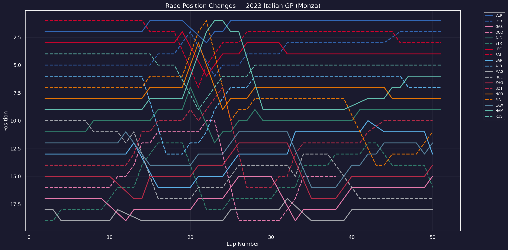
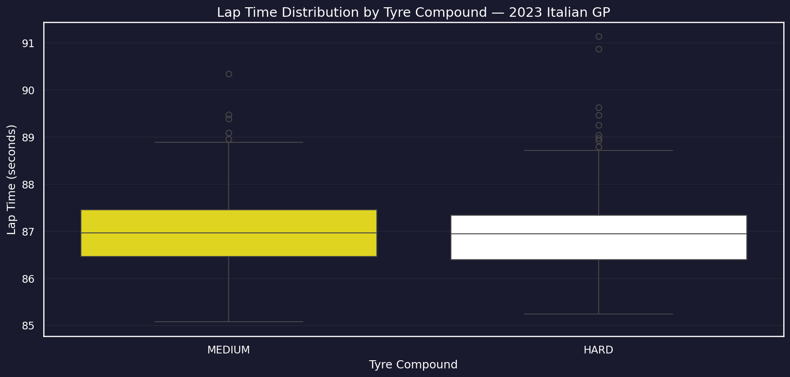
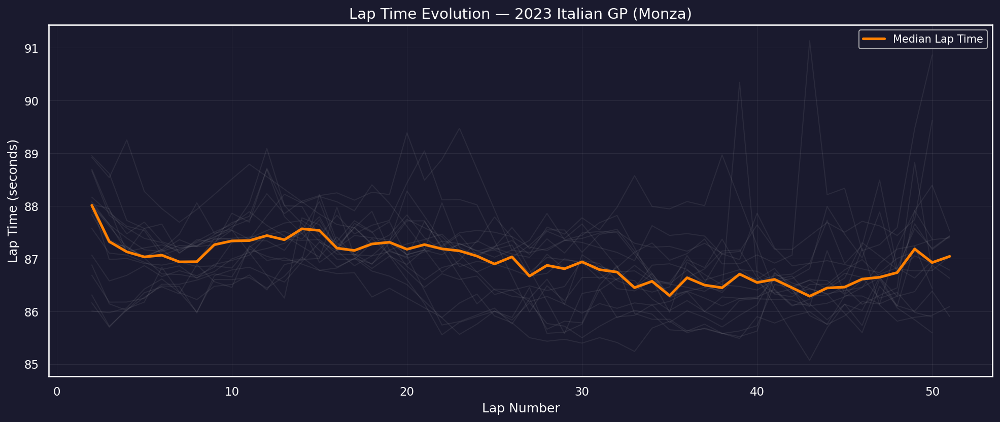
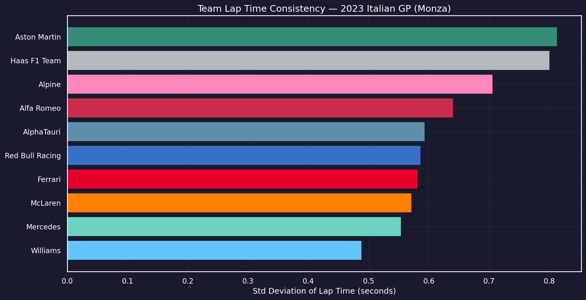
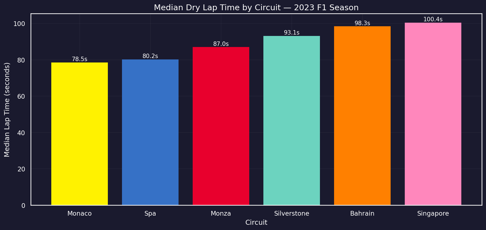
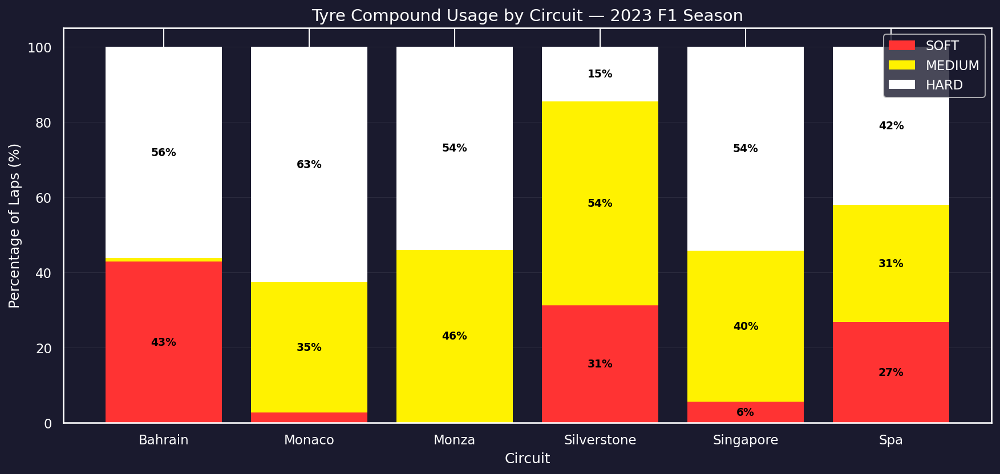
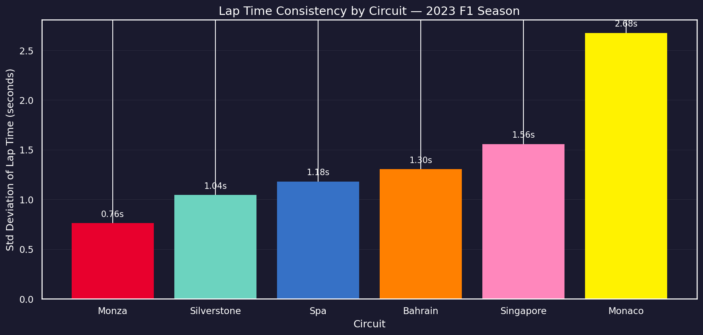
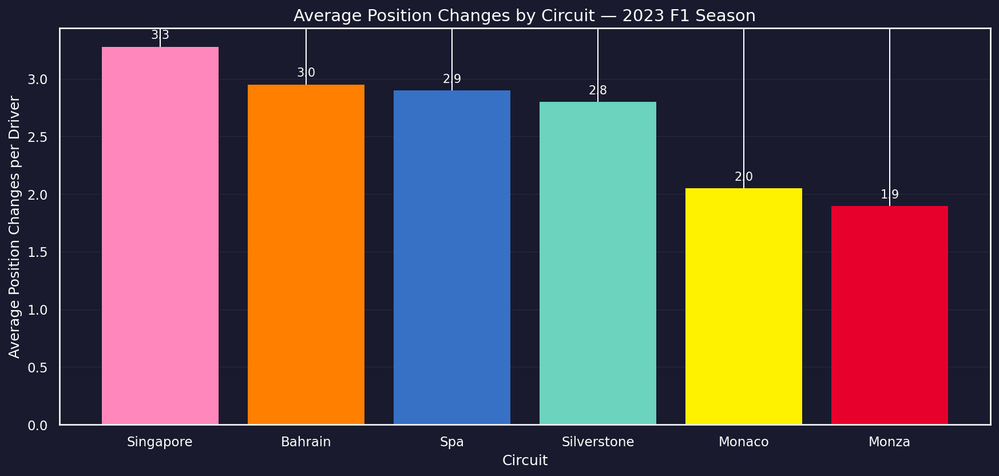
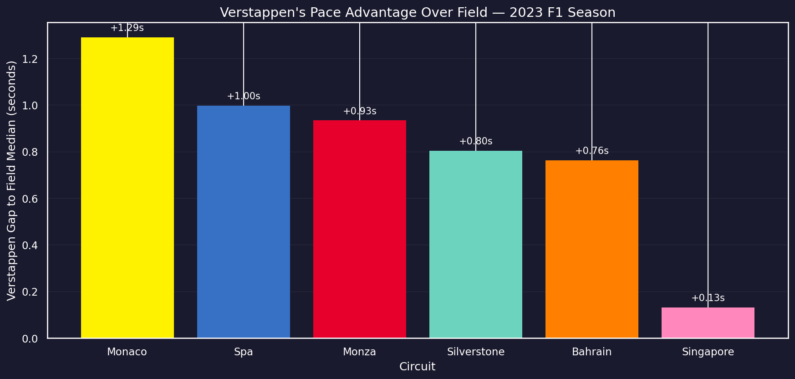

# F1 Data Analysis — Starting with Monza, Then Going Wider
I've had an interest in Formula 1 for a long time, but only recently started following the sport closely.
What stood out to me wasn't just the racing, but how much of it comes down to data - lap times, tyre strategy, pit stops, and consistency.

This started as an analysis of the 2023 Italian GP at Monza. Then I extended it to 5 more circuits to see if the patterns from Monza held up elsewhere. Mostly they didn't — which turned out to be the most interesting finding of all.

This is my first data science project. Still learning.

---

## What I wanted to find out
Starting with Monza, then across all 6 circuits: 

- How do positions change lap by lap, and how much of it is influenced by pit stops?
- Does tyre compound choice (Medium vs Hard) meaningfully affect lap times at Monza?
- Can you actually see tyre degredation in the lap time data?
- Which teams were most consistent — and does that even matter?
- Does a driver's (for example, Verstappen's) pace advantage look the same at every circuit?

---

# Part 1 — Monza 2023
## Key observation
One result that stood out was related to consistency.

Williams had the lowest variation in lap times among all teams, including high consistency, but still finished outside the points.

In contrast, Aston Martin showed much higher variation between drivers yet Alonso managed to finish P9.

This suggests that consistency alone is not a reiable indicator of race success. Race position, strategy, and overall pace have a larger impact.

---

## Observations from the data
While working with the dataset, a few issues and patterns required closer inspection.

- **Verstappen's pit stop laps are missing**. Laps 20 and 21 just don't exist in the cleaned dataset. FastF1 flagged them as inaccurate so they got filtered out during cleaning. I only figured out he pitted there by noticing the gap in lap numbers and the compound switching from Medium to Hard.
- **Tsunoda isn't in the data at all**. At first I thought it was a collection error. It wasn't — he had an engine failure on the formation lap and never started the race. Zero laps completed means zero rows in the dataset.
- **Hulkenberg looked like he was leading mid-race**. On the position plot he appears right at the top around laps 15-25. He wasn't actually faster than everyone — he just hadn't pitted yet. Once he did, he dropped to P17. This is called a "false leader" and it's easy to misread if you don't account for pit stop timing.
- **No soft tyres at Monza** — Only Hard and Medium compounds were present, confirming that assumptions about tyre availability should always be validated against the data

These observations highlight the importance of validating data assumptions and understanding race context before drawing conclusions from visualizations.

---

## Visualizations

### Race Position Changes


### Tyre Compund vs Lap Time


### Lap Time Evolution


### Team Consistency


# Part 2 — Extending to 6 Circuits
After finishing Monza I wanted to see if the findings were specific to Monza or if they held up elsewhere. I added Bahrain, Monaco, Silverstone, Spa, and Singapore — all very different from each other and from Monza.

## Multi-race data observations
- **Monza is the fastest circuit, Monaco the slowest** — but lap time alone is misleading. Singapore has the longest lap times of the six, not because it's slow but because the circuit is significantly longer than Monaco. Seconds per lap doesn't equal pace.

- **Tyre strategy is completely circuit-dependent**. Bahrain used the most Soft tyres despite being a high degradation circuit — teams run short aggressive Soft stints early then switch to Hard for the long run. Monaco barely used Soft at all, not because it's slow but because track position is everything there and pitting costs you places you can never get back as the circuit is narrow and overtaking is difficult.

- **Monaco's inconsistency comes from the weather, not the circuit**. It rained during the 2023 Monaco GP. Even filtering out wet laps, the remaining dry laps span a period where conditions were still changing. That creates lap time variation that has nothing to do with driver or car pace.

- **Singapore had the most position changes despite being a street circuit**. You'd expect Monaco-style processional racing. Instead high humidity, high tyre degradation, and multiple safety cars and pit stops created constant position shuffling — mostly through strategy rather than on-track overtaking.

- **Verstappen was fastest everywhere — but Singapore was where he struggled most**. His pace advantage over the field median was +1.29s at Monaco and only +0.13s at Singapore. 

- **The Monaco paradox**. Verstappen had his biggest pace advantage at Monaco but didn't win. At Monaco, qualifying position is race position — there's no overtaking. The data shows his pace, the result doesn't reflect it. Circuit characteristics don't just affect lap times, they affect whether being the fastest car even matters.

---

## Multi-race visualizations

### Average Lap Time by Circuit


### Tyre Compound Usage by Circuit


### Lap Time Consistency by Circuit


### Average Position Changes by Circuit


### Verstappen's Pace Advantage by Circuit



---

## Tools used 
- Python 3.12
- FastF1 — pulls official F1 timing data directly
- Pandas, NumPy, Matplotlib, Seaborn
- JupyterLab

---

## How to run it?
<pre>bash
git clone https://github.com/brojokishor/f1-eda.git 
cd f1-eda 

python3 -m venv venv
source venv/bin/activate

pip install -r requirements.txt

jupyter lab 
</pre>

Run the notebooks in order — 01 first, then 02, then 03.

---

## Project Structure
```
f1-eda/
├── data/
│   ├── raw/               # original data, never modified
│   └── processed/         # cleaned version used for analysis
├── notebooks/
│   ├── 01_data_collection.ipynb
│   ├── 02_data_cleaning.ipynb
│   └── 03_analysis_and_viz.ipynb
|   └── 04_multi_race_analysis.ipynb
├── outputs/
│   └── figures/           # saved plots
├── src/
│   └── helpers.py
├── requirements.txt
└── README.md
```

---

## Next steps
- Compare qualifying vs race performance — does pole position actually predict race wins? 
- Go deeper into sector times instead of just full lap timmes
- Add a simple ML model to predict podium finishers

Still learning!